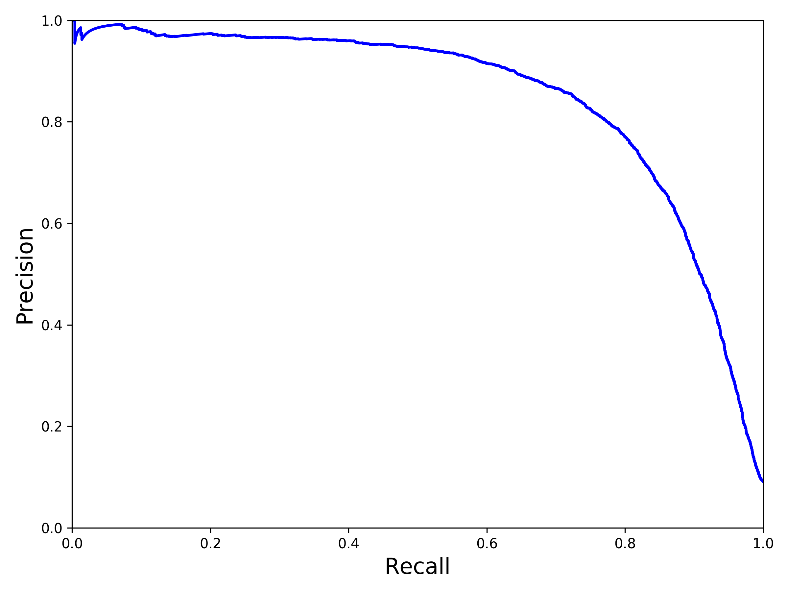
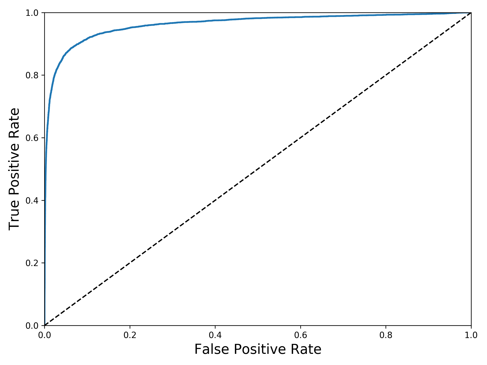

# Chapter 3

## Precision and Recall
The confusion matrix is a good way to evaluate the performance of a classifier. There are four classes in the confusion matrix: true positive, false positive, false negative, true negative. Each row in a confusion matrix represents an *actual class*(positive and negative), and each column represents a *predicted class*(true and false). 
$$Precision=\frac{TP}{TP+FP}$$
$$Recall=\frac{TP}{TP+FN}$$
$$F_1=\frac{2}{\frac{1}{precision}+\frac{1}{recall}}=\frac{2PR}{P+R}$$

### Precision versus recall
The F1 score favors classifiers that have similar precision and recall. This is not always the case: in some contexts precision matters, and in other contexts recall matters. 
One way to select a good precision/recall tradeoff is to plot the *precision/recall curve*.

Another way is to use *the ROC curve*(the receiver operating characteristic). Instead of plotting precision versus recall, the ROC curve plots the true positive rate(recall) against the false positive rate(1 - true negative rate). The TNR is also called *specificity*, which is the ratio of negative instances that are correctly classified as negative. Hence the ROC curve plots sensitivity(recall) versus 1 - specificity.
